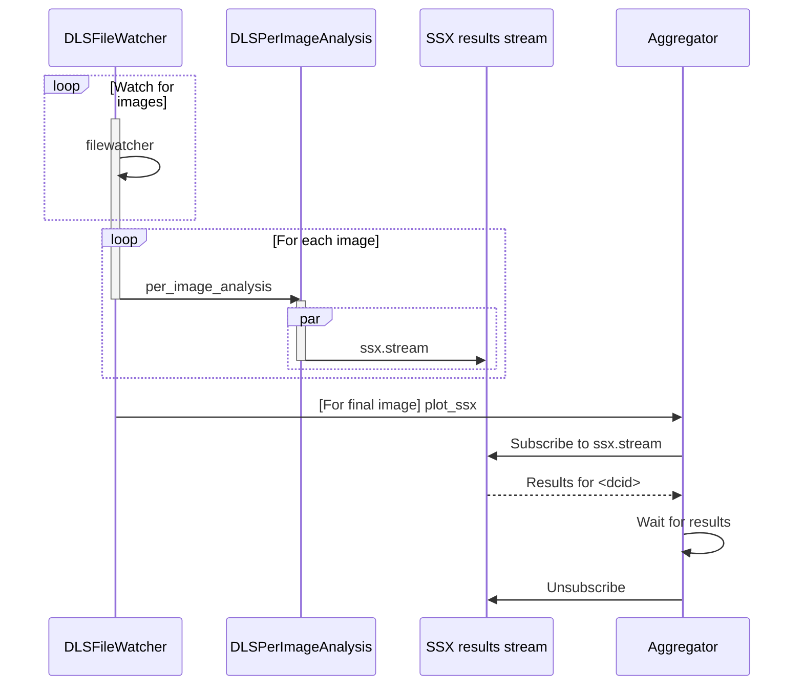

# Aggregation of SSX results

* Status: proposed
* Deciders: Richard Gildea, Nick Devenish
* Date: 2022-07-06
<!-- 
Technical Story: [description | ticket/issue URL] optional -->

## Context and Problem Statement

To support live analysis of SSX experiments we need to implement a form of
the [scatter-gather](https://www.enterpriseintegrationpatterns.com/patterns/messaging/BroadcastAggregate.html) pattern where some operation (e.g.
spotfinding, indexing or integration) is performed in parallel on each image,
followed by a step that aggregates the responses, e.g. to generate a plot or
map of the results.
How should we implement this in the context of Zocalo/RabbitMQ?

## Decision Drivers

* Handle high throughput (e.g. 500 message/second)
* Robust against aggregator being killed mid-process
* Handle high data volumes (e.g. 10 time-point fixed-target dose-series data
  collection could comprise 256,000 images)

## Considered Options

* High ``prefetch_count`` with single active consumer queue
* [JSON Lines](https://jsonlines.org/)-like text format to aggregate results
* [Redis](https://redis.io/) as data cache
* [RabbitMQ stream](https://www.rabbitmq.com/streams.html)  

## Decision Outcome

Chosen option: "RabbitMQ stream", because it meets the key decision drivers above, and doesn't require the addition of any new platform dependencies, comes out best (see below).

### Positive Consequences <!-- optional -->

* This would enable us to move custom I24 analysis scripts into dlstbx

<!-- ### Negative Consequences

* [e.g., compromising quality attribute, follow-up decisions required, …]
* … -->

## Pros and Cons of the Options <!-- optional -->

### High ``prefetch_count`` with single active consumer queue

* Good, because similar to the approach taken in X-ray centring.
* Good, proven approach that is robust against known failure modes.
* Bad, because ``prefetch_count`` is
  [limited to a maximum of 65535 messages](https://github.com/DiamondLightSource/python-dlstbx/commit/f4decc4f5a13e7677b136f21a372e4e056500901)
  which could be a blocker for some SSX experiments

### JSON Lines

[example | description | pointer to more information | …] <!-- optional -->

* Good, because simple, and demonstrated to work via Nick's custom I24 SSX scripts
* Good, because no additional dependencies
* Good, because we probably want to write the results in the ``$visit/processed``
  directory in some form
* Bad, because seems a relatively crude approach to caching information
* Bad, because potentially causes unnecessary filesystem load
* Bad, because potential for concurrent read/write issues, depending on implementation
* Bad, because would require additional service to write results to disk

### Redis as data cache

* Good, because acting as a data cache is one of Redis's main use cases
* Good, because Redis is relatively simple to set up and use
* Good, because well-suited for handling concurrent/parallel read/writes
* Bad, because adds additional maintenance burden to an already complicated software stack
* Bad, because would require an additional service to write results to redis

### RabbitMQ streams

* Good, because no additional dependencies
* Good, because can also use stream for displaying live plots on beamline
* Good, because streams are designed for high throughput and large message volumes
* Good, because streams have non-destructive consume behaviour
* Good, because it doesn't require an additional service to write the intermediate
  results to disk or database cache
* Bad, because requires relatively complex service as no natural scatter-gather
  mechanism in RabbitMQ
