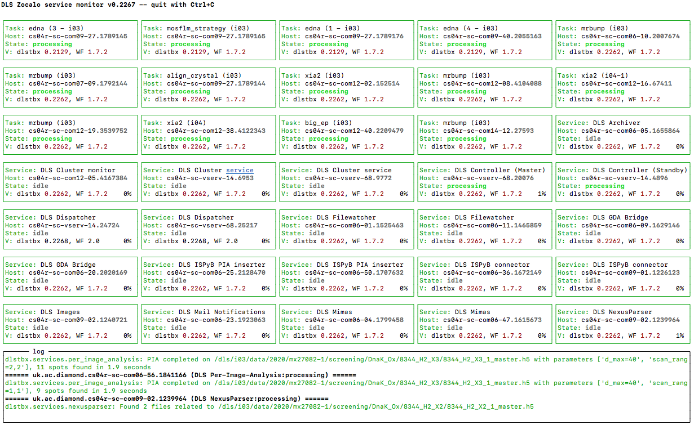
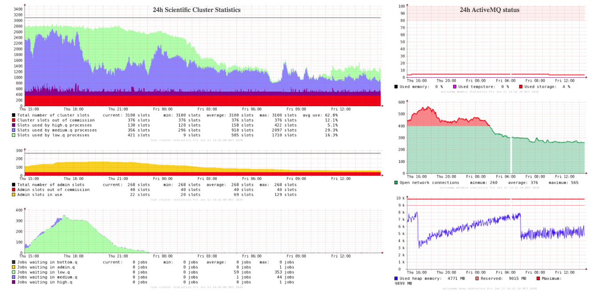
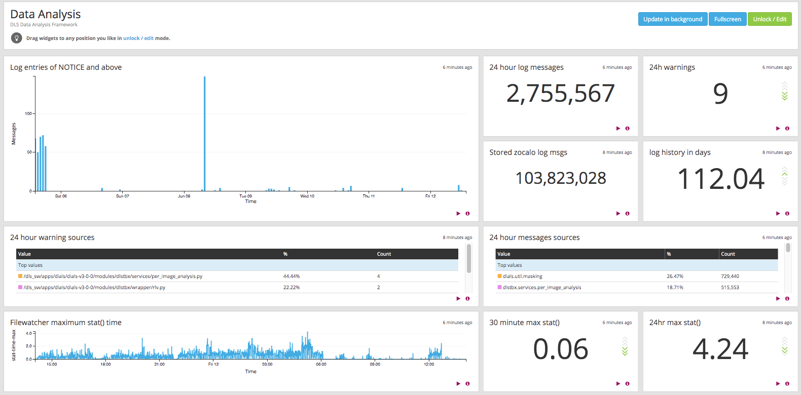
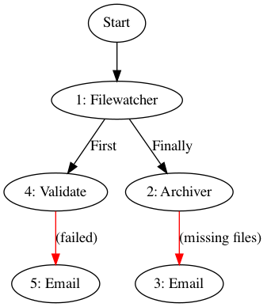
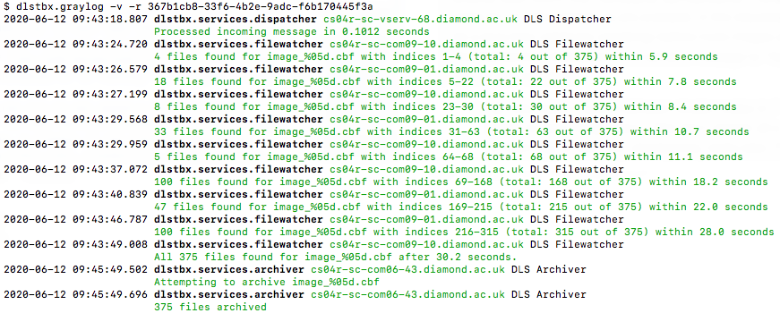

# Zocalo

The idea of Zocalo is simple one - to build a messaging framework, where text-based messages are sent between parts of the system to coordinate data analysis. In the wider scope of things this also covers things like archiving, but generally it is handling everything that happens after data aquisition.

Zocalo as a wider whole is made up of a number of public and private repositories:

- **[DiamondLightSource/python-zocalo]** - Relatively small repository, not too much in it at the moment. Chronologically this repositiory was created later as we started making parts of the internal system public. This is in [PyPi][PyPi-zoc] and [conda-forge][conda-forge-zoc], so easy to install in a python environment. It doesn't currently have much documentation, in future it is planned to put more non-Diamond-specific stuff - but the repo contains no private information, no access keys, no credentials, no site-local implementations.
- **[DiamondLightSource/python-workflows]** - It shouldn't be necessary to interact too much with this package, as the details are abstracted by Zocalo. workflows controls the logic of how services connect to each other and what a service is, and actually send the messages to the activeMQ broker (via [STOMP]). Not Diamond specific, though probably no users outside of Diamond. Also on [PyPi][PyPi-wf] and [conda-forge][conda-forge-wf].
- **Internal [github/dlstbx]** - This private repository contains Diamond-specific python code only used internally by Zocalo. This is somewhat tied into [DIALS] (_DIALS is a larger project that deals with primarily X-ray data diffraction. Support for EM is ongoing but is not really relevant for active use at the moment_). It's currently tied to DIALS because this allows usage of the DIALS release model, which makes keeping internal versions in sync easier. Most of the code in this package has to do with Zocalo. Commands that this package provide are (mostly) of the form `dlstbx.something`. A description of some of the commands provided by Zocalo can be found [here](commands.md).

- **Internal [gitlab/zocalo]** - This private repository contains the zocalo recipes and scripts to implement the internal data analysis workflows. It's checked out automatically into `/dls_sw/apps/zocalo/live` and pushing changes will affect the live analysis immediately.

Zocalo is built on top of [ActiveMQ]. ActiveMQ is an apache project that provides a [message broker] server, acting as a central dispatch that allows various serviced to communicate. Messages are plaintext, but from the Zocalo point of view it's passing aroung python objects (json dictionaries). Every message sent has a destination to help ActiveMQ route. ActiveMQ has two types of destinations - queues and topics. A queue has a message put into it by a sender, and only one of the (potentially many) listeners gets the message. A topic is effectively a broadcast - once a message goes in, every service that is subscribed to the topic gets a copy of the message. In developing with Zocalo, you may have to interact with ActiveMQ, but it is unlikely that you will have to configure it - the configuration is somewhat complex and fiddly (the `module load activemq/zocdev` module is a quick way to get a preconfigured test instance if you require one).

[DiamondLightSource/python-zocalo]: https://github.com/DiamondLightSource/python-zocalo
[DiamondLightSource/python-workflows]: https://github.com/DiamondLightSource/python-workflows/
[STOMP]: https://stomp.github.io/
[PyPi-zoc]: https://pypi.org/project/zocalo/
[conda-forge-zoc]: https://anaconda.org/conda-forge/zocalo
[PyPi-wf]: https://pypi.org/project/workflows/
[conda-forge-wf]: https://anaconda.org/conda-forge/workflows
[github/dlstbx]: https://github.com/DiamondLightSource/python-dlstbx
[gitlab/zocalo]: https://gitlab.diamond.ac.uk/scisoft/zocalo
[ActiveMQ]: http://activemq.apache.org/
[DIALS]: https://dials.github.io/
[message broker]: https://en.wikipedia.org/wiki/Message_broker

## Core Concepts

Zocalo has the concept of _services_ and _wrappers_. These are similar in some ways - both interact with messages.
A service should handle a discrete short-lived task, for example finding spots on a single image, or inserting results into a database.
In contrast, wrappers can be used for longer running tasks, for example running data processing programs such as [xia2](https://xia2.github.io/) or [fast_ep](https://github.com/DiamondLightSource/fast_ep).
- A **service** starts in background and waits for work. There are many services constantly running as part of normal Zocalo operation, which you can observe by looking at what is running on the cluster:
    ```bash
    $ module load global/cluster
    $ qstat -u gda2 | grep zocalo-svc
    ```
    At time of writing, there are ~112 services running.
- A **wrapper** on the other hand, is only run when needed. They wrap something that is not necessarily aware of Zocalo - e.g. MX downstream processing software such as xia2 have no idea what zocalo is, and shouldn't have to. A wrapper takes a message, converts to the instantiation of command line, runs the software - typically as a cluster job, then reformats the results into a message to send back to Zocalo. An example is the xia2 wrapper - as an example you can see any of these currently running with:
    ```bash
    $ qstat -u gda2 | grep xia2
    36689264 10.49083 zoc-xia2-3dii         gda2...
    36694636 3.82359 zoc-xia2-3dii         gda2...
    36694186 1.49029 zoc-xia2-dials        gda2...
    ```
    These processes have no idea what Zocalo is, but are being run by a script that handles the wrapping. We'll discuss how these are launched later.

With many services and wrappers running, how do they communicate? And how do they know where to begin? Everything goes to one service to start with, the **Dispatcher**. This takes the initial request message and attaches useful information for the rest of Zocalo. The [ISPyB database](https://github.com/DiamondLightSource/ispyb-database) that stores information about what is run, metadata, how many images, sample type etc. This influences what software we want to be running - and this information might need to be read from the database in many, many services. We obviously don't want to read the same thing from many clients and flood the database, and don't want the database to be a single point of failure.

The dispatcher front-loads all the database operations - it takes the data collection ID (DCID) and looks up in ISPyB all the information that could be needed for processing. In terms of movement through the system, it sits between the initial message and the services:

```
message -> Dispatcher -> [Services]
```
At end of processing there might be information that needs to go back into the databases, this is handled by a special ISPyB service to do the writing. If the DB goes down, that is fine - things will queue up for the ISPyB service and get processed when the database becomes available again, and written to the database when ready. This isolates us somewhat from intermittent failures.

A description of some of the services provided by Zocalo can be found [here](services.md).

# Monitoring

If you have hundreds of services running it can be difficult to tell what is going on - have commands to help. The first of these is `dlstbx.status_monitor`:



This provides a "birds-eye" overview of connected services, their activity status, and shows a running log. Boxes labelled "Service:" are services, and boxes labelled "Task:" are wrappers. This is designed as a general overview, and there are usually more services than can be displayed all at once (zooming out the terminal can help with this, to a certain extent). If a service is unresponsive, then you can see the last time that it was seen by the monitor.

Some other services you can see on this snapshot of the overview:
- `DLS Cluster Service` - this allows submitting of jobs to the cluster
- `DLS Cluster Monitor` - This generates data for the cluster monitoring page that can be accessed at http://ws312.diamond.ac.uk:3000 and gives a general overview of the current load on the cluster and ActiveMQ server:
    

To get a list of possible services, you can run
```bash
$ dlstbx.service --help
```
which currently gives:
```
DLSArchiver, DLSCluster, DLSClusterMonitor, DLSController, DLSDispatcher,
DLSDropfilePickup, DLSDummy, DLSFileWatcher, DLSISPyB, DLSISPyBPIA, DLSImages,
DLSMailer, DLSMimas, DLSNexusParser, DLSNotifyGDA, DLSPerImageAnalysis,
DLSStatistics, DLSStreamAnalysis, DLSStreamDispatcher, DLSStreamdumperI022,
DLSStreamdumperI03, DLSStreamdumperI04, DLSStreamdumperTest, DLSTrigger,
DLSValidation, DLSXRayCentering, LoadProducer, LoadReceiver, Schlockmeister,
SampleConsumer, SampleProducer, SampleTxn, SampleTxnProducer
```

With hundreds of services running at once, figuring out what is going on can be hard - log messages can go by fast. To keep track of of this over a longer timescale, we have Graylog.

### Graylog

[Graylog](https://www.graylog.org/) is a log management service, which we have installed at https://graylog2.diamond.ac.uk. Everything in zocalo that is logged gets sent to the graylog service, and ~100 days of log history is stored. This logging is configured as part of the service setup - when you run a service it knows where to find the Zocalo and Graylog connection information, and messages are hooked into the standard python logging framework. You can search and filter specific messages from this web interface. There's a data analysis [dashboard](https://graylog2.diamond.ac.uk/dashboards/5a5c7f4eddab6253b0d28d1c) that shows a summary of throughput, and indicates the presence of warnings or errors:



In the last 24 hours 9 warnings - not too bad, everything going reasonably well.

In addition to the web interface, there is a `dlstbx.graylog` command line interface to the graylog service. By default, running it will give an overview of last 5 minutes of messages, but you can grep the results, follow live, can filter by recipe - pass `--help` to get the options.

You can ask for more detail by passing in various levels of verbosity:
```bash
$ dlstbx.graylog -vvvvv -s dlstbx.services.archiver
...
2020-06-12 10:48:03.023000+01:00
                    _id: cef130d1-ac91-11ea-bcdf-1866dafadc6c
               facility: dlstbx.services.archiver
                   file: /dls_sw/apps/dials/dials-v3-0-0/modules/dlstbx/services/archiver.py
               function: archive_dcid
                  level: 6
             level_name: INFO
                   line: 254
                message: 2 files archived
                    pid: 1223018
           process_name: workflows-service
              recipe_ID: 42ee2fdd-589b-4f5e-b13f-3e00c819dab4
                 source: cs04r-sc-com09-02.diamond.ac.uk
            thread_name: MainThread
              timestamp: 2020-06-12T09:48:03.023Z
workflows_cluster_JOB_ID: 36693633
workflows_cluster_SGE_CELL: DLS_SCIENCE
       workflows_dlstbx: dlstbx 0.2262-ge3b99e9
         workflows_host: uk.ac.diamond.cs04r-sc-com09-02.1222995
      workflows_mem-uss: 32215040
      workflows_service: DLS Archiver
 workflows_serviceclass: DLSArchiver
       workflows_status: 4
   workflows_statustext: processing
          workflows_tag: ea726497-29e8-403c-be80-1139ef2f174c
  workflows_utilization: {"2":0.9963,"4":0.0037}
    workflows_workflows: 1.7.2
```
Here we're given a lot of information about this particular message, from the archiver service - along with the message, "6 files archived" e.g. how much went onto tape. We have information about what service this message came from, things like version numbers, if an exception happened then we will get the stack trace.

One important piece of information here is the "recipe_ID":

```bash
recipe_ID: 1039019e-c12f-4dca-b14d-ce13c2c6f1a4
```

## Recipes

The dispatcher offers a set of scenarios - it extracts information from the database about a given DCID from your message, but what do you want to do after that? To control this, you submit a **[recipe]** with the message. This is implemented by the workflows package. A recipe is essentially a flowchart, or _graph_, describing the connection between services. It is a specific kind of graph known as a [Directed acyclic graph][DAG], which basically means that there is a direction and no loops allowed.

[recipe]: https://github.com/DiamondLightSource/python-workflows/tree/master/workflows/recipe
[DAG]: https://en.wikipedia.org/wiki/Directed_acyclic_graph

Let's look at an example - a slightly simplified version of [archive-cbfs.json], which archives image files on beamlines that are using CBF writing - skim over it to identify the structure, then we will discuss the meaning of specific parts:

```json
{
  "1": {
    "service": "DLS file watcher",
    "queue": "filewatcher",
    "parameters": {
      "pattern": "{ispyb_dc_info[imageDirectory]}{ispyb_image_pattern}",
      "pattern-start": "{ispyb_image_first}",
      "pattern-end": "{ispyb_image_last}",
      "timeout": 900,
      "timeout-first": 900
    },
    "output": {
      "first": 4,
      "finally": 2
    }
  },
  "2": {
    "service": "DLS Archiver",
    "queue": "archive.pattern",
    "transport-delay": 120,
    "parameters": {
      "pattern": "{ispyb_dc_info[imageDirectory]}{ispyb_image_pattern}",
      "pattern-start": "{ispyb_image_first}",
      "pattern-end": "{ispyb_image_last}",
      "limit-files": 1000,
      "dropfile-queue": "darc.dropzone"
    },
    "output": {
      "missing_files_within": 3
    }
  },
  "3": {
    "service": "DLS Mail Notification",
    "queue": "mailnotification",
    "parameters": {
      "recipient": {
        "all": [
          "person_a@diamond.ac.uk",
        ],
        "select": "{ispyb_beamline}",
        "i03": [
          "i03_sample_contact@diamond.ac.uk",
        ],
        "..."
      },
      "subject": "Lost files on {ispyb_beamline} in data collection {ispyb_dcid}",
      "content": [
          "..."
      ]
    }
  },
  "4": {
    "service": "Image validation",
    "queue": "validation",
    "parameters": {
      "beamline": "{ispyb_beamline}",
      "ispyb_wavelength": "{ispyb_dc_info[wavelength]}"
    },
    "output": 5
  },
  "5": {
    "service": "DLS Mail Notification",
    "...sends metadata notification..."
    }
  },
  "start": [
    [
      1,
      []
    ]
  ]
}
```
A recipe is a JSON object, or a python dictionary, with a list of named nodes, `"1"`, `"2"`, `"3"` etc, and a `"start"` node. Each of the named nodes corresponds to a service, and each  have a `"parameters"` dictionary - the one for the archiver controls how the archiver works, the one for the FileWatcher control what files and the ranges it's looking for, and each services can send further messages via various `"output"` nodes that each service supports. The `"start"` node points to the first node, that the dispatcher will send the message and recipe on to once the DCID information has been attached.

In this case, the first node is a `FileWatcher` instance. The Filewatcher service is given a file path, then watches for those files to appear on disk. Once it sees the first file, it sends a message to node `"4"`, an image validation service, which checks the image and sends an email (via sending an onwards message to the `MailNotification` service `"5"`) in case there is an error in the validation. Filewatcher demonstrates a pattern present in many services - that it can send multiple messages in different scenarios - with the `"output"` value being a dictionary of possible connections rather than a single node to run next. Each service can have any number of possible output definitions.

Once the filewatcher has seen all of the images appear, it sends a message to node `"2"`, the archiver service. This service archives the images, then terminates the recipe. In the event of an error archiving, defined by the `"files-missing"` output connection, this service sends a message to node `"3"`. This is the same service as node `"5"`, the `MailNotification` service, but in this case is configured with a different message and set of email contacts, so even though the same physical service is processing the message, a different email is sent out.

This process can be expressed as a flow-graph:



Some of the most important recipes are described here:

[Mimas](mimas.md)

[Per-image analyisis](per-image-analysis.md)


[archive-cbfs.json]: https://gitlab.diamond.ac.uk/scisoft/zocalo/-/blob/a9975fe8b4f07f27b4f4e86e315f0b14b0538009/recipes/archive-cbfs.json


| Q: How are services started?
| ---
| A: Zocalo itself is agnostic on this point. Some of the services are self-propagating and employ simple scaling behaviour - in particular the per-image-analysis services. The services in general all run on cluster nodes, although this means that they can not be long lived - beyond a couple of hours there is a high risk of the service cluster jobs being terminated or pre-empted. This also helps encourage programming more robust services if they could be killed - sort of our own in-house chaos monkey, except as a normal scheduler.

| Q: How many nodes are on the cluster?
| ---
| A: Looking at the Zocalo cluster monitor, there are about 3000 slots, distributed amongst different sizes of machines. The bulk of the nodes have ~20 slots each. There are also the test and Hamilton clusters. Hamilton is used for running wrappers but not for running services. The Test cluster is used as a fallback in cases where there are problems running jobs in the main cluster and it's causing significant issues in serving Zocalo requests, effectively trying to work around broken infrastructure.

| Q: Some of this sounds like Kubernetes... why doesn't it use that?
| ---
| A: Kubernetes in Diamond is a relatively new service and this system predates it by some time - in addition, it's not yet thoroughly supported, or battle-tested by users. Moving to Kubernetes for service management and control is a reasonable direction to go to in the future, however, because it could potentially simplify some of the service logic. None of Zocalo was directly inspired by Kubernetes, but many of the concepts are well established and Kubernetes was codifying them into a whole. Any similarities are more a case of convergent evolution....

| Q: How long did this take to come together?
| ---
| A: The system was built over the course of a year or so. Things kept falling over all the time, the aim was to design a system that was robust and where errors could be isolated, which is how we ended up in a message-based solution. Not everything was moved at once - started with small parts like archiving - this lowered the load on the cluster considerably, as archiving in many cases took over an hour, even though it resulted in just a small XML output. The final components, the post-data-collection triggering, moved to Zocalo in early 2020 - now everything is using the system, except GDA - which doesn't communicate directly, but runs a simple bash script - [RunAtEndOfCollect.sh] - that simply sends a message to the dispatcher and MIMAS service with a recipe and the DCID specified - `dlstbx.go -r mimas -s event=end -s ispyb_wait_for_runstatus=1 ${DCID}`, and the recipe takes care of the rest.

[RunAtEndOfCollect.sh]: https://gitlab.diamond.ac.uk/scisoft/mx/mx-scripts/-/blob/c39ad30105fabb6e68e37ff9fc6046721cef8046/bin/RunAtEndOfCollect-mimas.sh

### Digging into recipe execution

Now we know what a recipe is, let's look at a how it is executed.

When we looked at the recipe above, you may have noticed many of the fields had what looked like placeholder entries e.g. in the FileWatcher parameters:

```json
    "pattern": "{ispyb_dc_info[imageDirectory]}{ispyb_image_pattern}",
```
Filling these out (alongside providing as much DB information as possible) is one of the jobs done by the Dispatcher - the recipe acts like a template, and the dispatcher fills in the missing values.

From the graylog extract above:

```
recipe_ID: 42ee2fdd-589b-4f5e-b13f-3e00c819dab4
```
We can inspect the changes the dispatcher made with:

```bash
$ dlstbx.show_recipeID 42ee2fdd-589b-4f5e-b13f-3e00c819dab4
```

Now we get a whole screenful of output about the job that the dispatcher did. We have sections for:

- **Incoming message header** - The header of the initial message, which can be useful for tracing the origins of the message.
- **Incoming message body** - The contents of the initial message, e.g. the DCID and parameters sent to `dlstbx.go`.
- **Parsed message body** - The contents of the message _after_ being processed by the dispatcher e.g. with ISpyB information inserted into the message contents.
- **Recipe object** - The recipe submitted with template substitutions applied.

The recipe object being filled out means that you can see what was actually forwarded to the services; e.g. in this example the FileWatcher now has an actual filename and range of collected images:
```json
    "service": "DLS file watcher",
    "parameters": {
      "pattern": "/dls/i23/data/2020/cm26461-3/20200612/sample_from_1_4/data_1s_1_%05d.cbf",
      "pattern-end": "2",
      "pattern-start": "1",
      "timeout": 900,
      "timeout-first": 900
    },
```
In addition, we can see a whole load if `"ispyb_*"` fields have been added into the parsed message body - everything that the Dispatcher could pull out of the database, ideally everything that you _could_ have about an image, so that services don't need to contact the database themselves.
```json
    ...
    "ispyb_dcid": 5073790,
    "ispyb_image": "/dls/i23/data/2020/cm26461-3/20200612/sample_from_1_4/data_1s_1_00001.cbf:1:2",
    "ispyb_image_directory": "/dls/i23/data/2020/cm26461-3/20200612/sample_from_1_4/",
    "ispyb_image_first": 1,
    "ispyb_image_last": 2,
    ...
```
At the top, you can even see the original message that triggered the recipe - e.g. the parameters and DCID passed to `dlstbx.go`:
```
Incoming message body:
{
  "parameters": {
    "guid": "42ee2fdd-589b-4f5e-b13f-3e00c819dab4",
    "ispyb_dcid": 5073790
  },
  "recipes": [
    "archive-cbfs"
  ]
}
```

The detailed graylog view and message headers here can be useful to see the original host, the user used to submit - to trace where a message came from. This is useful for e.g. finding a malfunctioning node, or perhaps a developer accidentally flooding Zocalo with too many messages. Inside Zocalo there is not much flow control - Denial-of-Service is possible, and some coordination is required to prevent issues. This isn't just theoretical - there are known issues in orchestration that can lead to out-of-control delays.

You can also ask GrayLog to restrict messages to a specific recipe e.g.

```bash
$ dlstbx.graylog -r 42ee2fdd-589b-4f5e-b13f-3e00c819dab4
```
And you will _only_ see the messages caused by services processing this specific recipe, tracing all logs to do with this recipe, across all services:



Run with the `-v` flag, here, you can see the message jumping from host to host in a sequence of messages. In this instance, you can also see the messages jumping from cluster node to node within the FileWatcher service.

Why does the message switch between cluster nodes for FileWatcher? The filewatcher is a central part of many recipes, but images can take a long time (relatively speaking) to appear - you don't want to have to run hundreds of services because each one is blocked up for minutes at a time (not to mention the load of the filesystem), and tracking multiple instances in a single service at once would make the FileWatcher much more complicated.

Instead of sitting and waiting, the filewatcher looks for a slice of images - say, 100, and if those images don't exist it checkpoints it's progress and sends a message to itself via Zocalo with the status. The service is then free to go serve other messages that might be waiting.

In this instance, the Filewatcher found four images, but not the fifth. It then sent itself the checkpoint status. The next time it handled this, a couple of seconds later, images 5-22 had appeared, but no more - so it saves it's state and goes on to process other tasks. Eventually it finds the 375th image, and can send the completion message onwards to the Archiver.

This works as a method of load balancing - in general, services try to not spend a long time processing a single request, and using the message queues as a way to balance requests. A wrapper is the tool to use for long-term processing - it goes into the cluster queue with other jobs, is lower priority than services and is preemptible. A service should be almost instantaneous.


| Q: In Per-Image-Analysis, is each image looked at independently?
| ---
| A: Yes, PIA has about 80 or so instances running at the same time - it takes up to a few seconds per image, and they are handled one message per image. This is short enough to run in a service, because starting a new cluster job or wrapper for each image would be prohibitively expensive compared to the actual time spent processing. At a few seconds per image, if the service is terminated while processing, then another one can quickly come along and pick up the message

| Q: So if a service is terminated in the middle of processing it will still get processed?
| ---
| A: Yes, messages are handled in transactions - while a service is processing a message, it's marked as "in-progress" but isn't completely dropped. If the service doesn't process the message, or it's connection to ActiveMQ gets dropped, then it get's re-enqueued so that another instance of the service can pick it up.

## Repeat Message Failure

How are repeat errors handled? This is a problem with the system - if e.g. an image or malformed message kills a service then it will get re-enqueued, and will eventually kill all instances of the service running (which will get re-spawned, and then die, and so forth).

We have a special service that looks for repeat failures and moves them to a special "Dead Letter Queue" - there is a command to check these:

```bash
$ dlstbx.dlq_check
DLQ for zocalo.per_image_analysis contains 4 entries
Total of 4 DLQ messages found
```

This service is called **[Schlockmeister]**, and is the only service at time of writing that has migrated to the public zocalo repository. This service looks inside the message that got sent, extracts some basic information from the message in as safe a way as possible and repackages to the DLQ with information on what it was working on, and the "history" of where the message chain has been routed.

[Schlockmeister]: https://github.com/DiamondLightSource/python-zocalo/tree/master/zocalo/service
