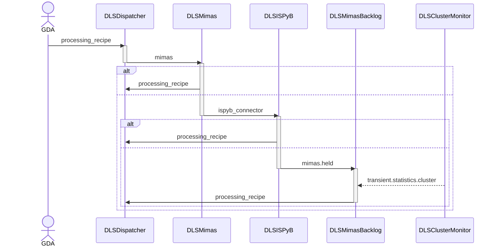

# Mimas

Mimas is responsible for the _business logic_ within Zocalo - i.e. "what processing should
be done given a data collection ID?" It is triggered indirectly by GDA, via the
beamline `RunAtStartOfCollect` or `RunAtEndOfCollect` scripts that live in
`/dls_sw/apps/mx-scripts/bin/`.

This script triggers mimas by running the `dlstbx.go` command, specifying `mimas` as the
recipe (`-r mimas`) and passing the event parameter to indicate whether this mimas job
was triggered by a start or end of data collection event (`-s event=start` or
`-s event=end` respectively). This command sends the recipe to the `processing_recipe`
queue, which is monitored by the `DLSDispatcher` service.

The `DLSDispatcher` service populates the recipe with relevant information from ISPyB,
and sends the resultant recipe to the `mimas` queue, where it will be picked up by the
`DLSMimas` service.

This first constructs a `dlstbx.mimas.MimasScenario` which contains all the information
that mimas requires to determine what processing to do for the given data collection.
This scenario is then provided to the function `dlstbx.mimas.core.run()`, which returns
a list of tasks to run. A task is either an instance of
`dlstbx.mimas.MimasRecipeInvocation` or `dlstbx.mimas.MimasISPyBJobInvocation`. The former
are recipes that are to be triggered directly, by sending to the `processing_recipe`
queue. The latter are recipes that are to be indirectly triggered, being sent to the
`ispyb_connector` queue where they will be acted upon by the `create_ispyb_job` method
of the `DLSISPyB` service. Each task is first serialized into a form that can be sent via
Zocalo before being sent to the appropriate message queue.

The `DLSISPyB` service inserts entries into the ISPyB ProcessingJob,
ProcessingJobParameter and ProcessingJobImageSweep tables, before either forwarding the
recipe to the `trigger` or `held` output , which correspond to the `processing_recipe`
queue or the `mimas.held` queue respectively. The decision of whether to trigger a recipe
immediately or send it to the held queue is determined by the value of the `autostart`
parameter the mimas task.

If the recipe has been sent to the `processing_recipe` queue it will be picked up by the
`DLSDispatcher` service and processed immediately.

The `DLSMimasBacklog` service monitors the `mimas.held` queue and forwards held recipes to
the `processing_recipe` queue whenever there is sufficient free capacity in the cluster.
