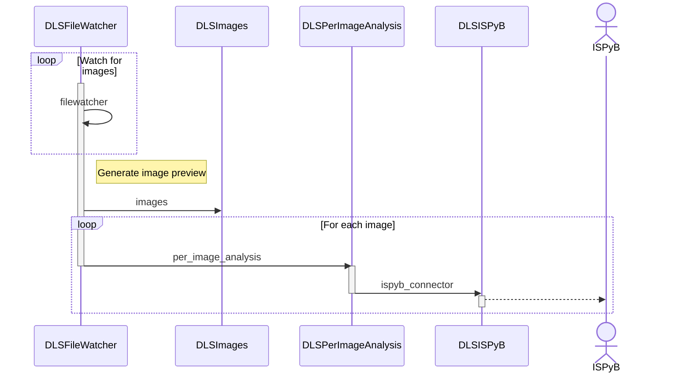
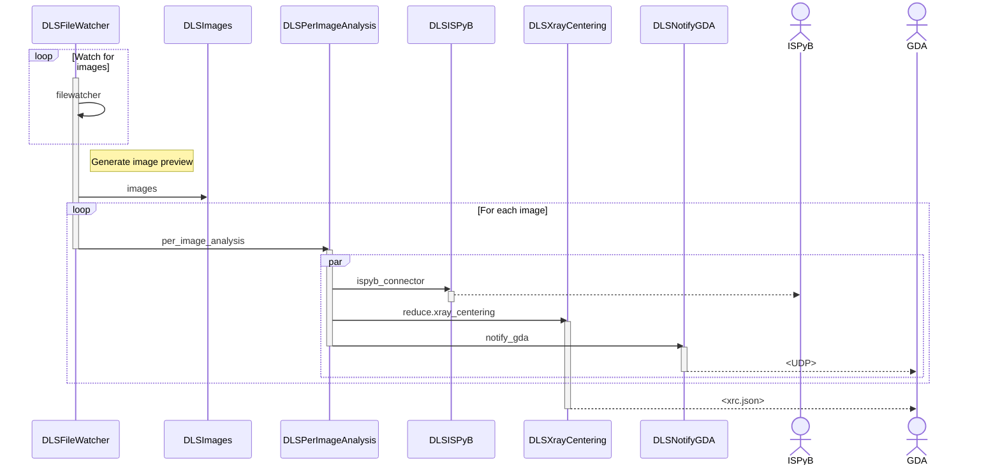

# Per-image analysis

This consists of four similar recipes handling the cases of CBF and HDF5 files, for both
rotation scans and grid-scans. These recipes analyse all, or a subset, of the diffraction
images in a data collection for potential Bragg diffraction spots, estimate a resolution
limit for each image, and record the results in ISPyB. For gridscans, further X-ray
centring analysis is performed, and the recipe also notifies GDA of the per-image analyis
results.

## Rotation data collections

Figure 1 shows the sequence of steps performed by the `per-image-analysis-rotation`
recipe. The recipe begins with the `DLSFileWatcher` service,
which subscribes to the `filewatcher` queue. When the first image is detected, this is
forwarded to the `DLSImage` service which generates a diffraction image preview for
SynchWeb.

The `DLSFileWatcher` service also selects 250 equidistant images from the data set, and
forwards each selected image to the `DLSPerImageAnalysis` service, which identifies
potential Bragg diffraction spots, estimates a resolution limit for the image, and
sends the results to the `store_per_image_analysis_results` method of the `DLSISPyB` via
the `ispyb_pia` queue, where the results are stored into ISPyB.

Figure 1. Per-image analysis rotation recipe

## Gridscan data collections

Figure 2 outlines the sequence of steps performed by the per-image analysis gridscan
recipes. These are similar to above, with the exception that _all_ images are forwarded by
the `DLSFileWatcher` service to the `DLSPerImageAnalysis` service. In addition to sending
the results to the `DLSISPyB` service, the results are also sent to the `DLSNotifyGDA`
service via the `notify_gda` queue and to the `DLSXrayCentering` service via the
`reduce.xray_centering` queue.

The `DLSNotifyGDA` service forwards per-image-analysis results to GDA via a UDP socket.
The `DLSXrayCentering` service aggregates per-image-analysis results and attempts to
identify an X-ray centering solution for a data collection. Results are written to
the file `{ispyb_results_directory}/xray-centering/Dials5AResults.json`, which is then
picked up by the GDA autocentring routine.

Figure 2. Per-image analysis gridscan recipe

The `per-image-analyis-gridscan-swmr` recipe provides an alternative approach to handling
real-time per-image analysis of gridscans from EIGER beamlines. This assumes that HDF5
files produced by EIGER detectors are written using
[SWMR mode](https://docs.h5py.org/en/stable/swmr.html), which allows concurrent reading
of a HDF5 file while it is being written from another process.

This recipe has two HDF5/SWMR-specific `DLSFileWatcher` steps. The first `DLSFileWatcher`
step watches for the arrival of the primary `.nxs` file on disk. After a short delay, a
second `DLSFileWatcher` step opens the primary `.nxs` file in SWMR mode and determines
how many images are to be expected for this data collection. As each image is written to
disk, it is forwarded to the `DLSPerImageAnalysis`, where the recipe continues as
described above.
