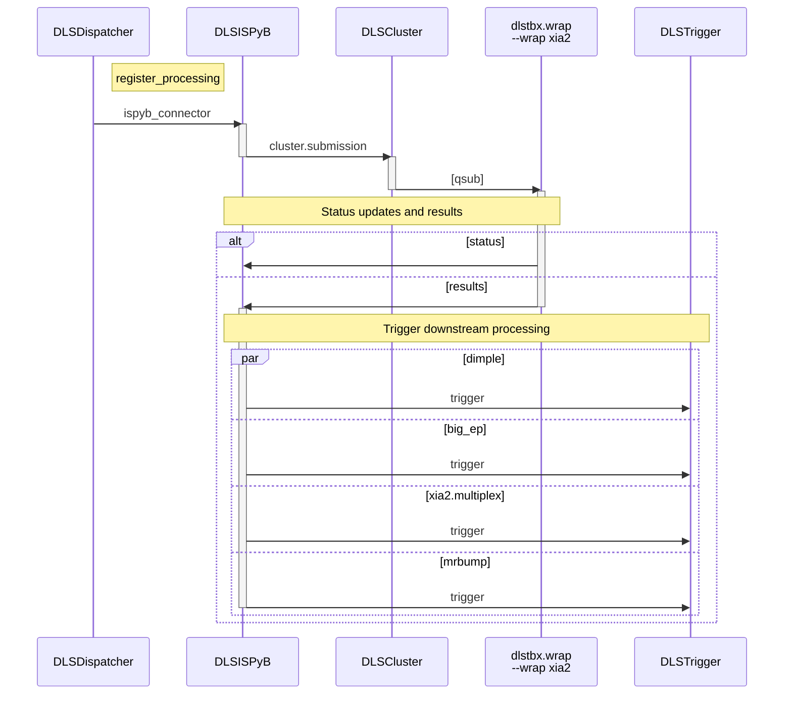

# Autoprocessing recipes

Figure 1 shows an example of a typical autoprocessing recipe - in this case `xia2`.
The recipe is initiated by the `DLSDispatcher` service which sends a message to the
`register_processing` command of the `DLSISPyB` service via the `ispyb_connector`
queue. This creates an entry in the `ProcessingJob` table of `ISPyB` so that (e.g.)
SynchWeb knows that there is ongoing processing associated with a given data collection
(allowing it to display e.g. spinning ⚙, ✅	or ❌ depending on job status).

Next, a message is sent to the `DLSCluster` service which then sends submits a job
to the Grid Engine cluster scheduler via the `qsub` command. This runs a "wrapper"
around `xia2` via the `dlstbx.wrap` CLI. The `xia2` wrapper communicates status
updates (e.g. `running`, `success` or `failure`) to the `DLSISPyB` service.
Results such as unit cell, space group and merging statistic, and output files
such as reflection files, html reports and log files are recorded in ISPyB via the
`DLSISPyB` service.

A number of downstream processing recipes are then potentially triggered via
messages to the `DLSTrigger` service, which will decide whether to trigger a
specific downstream recipe e.g. based on prior information stored in ISPyB.

Figure 1. xia2 recipe