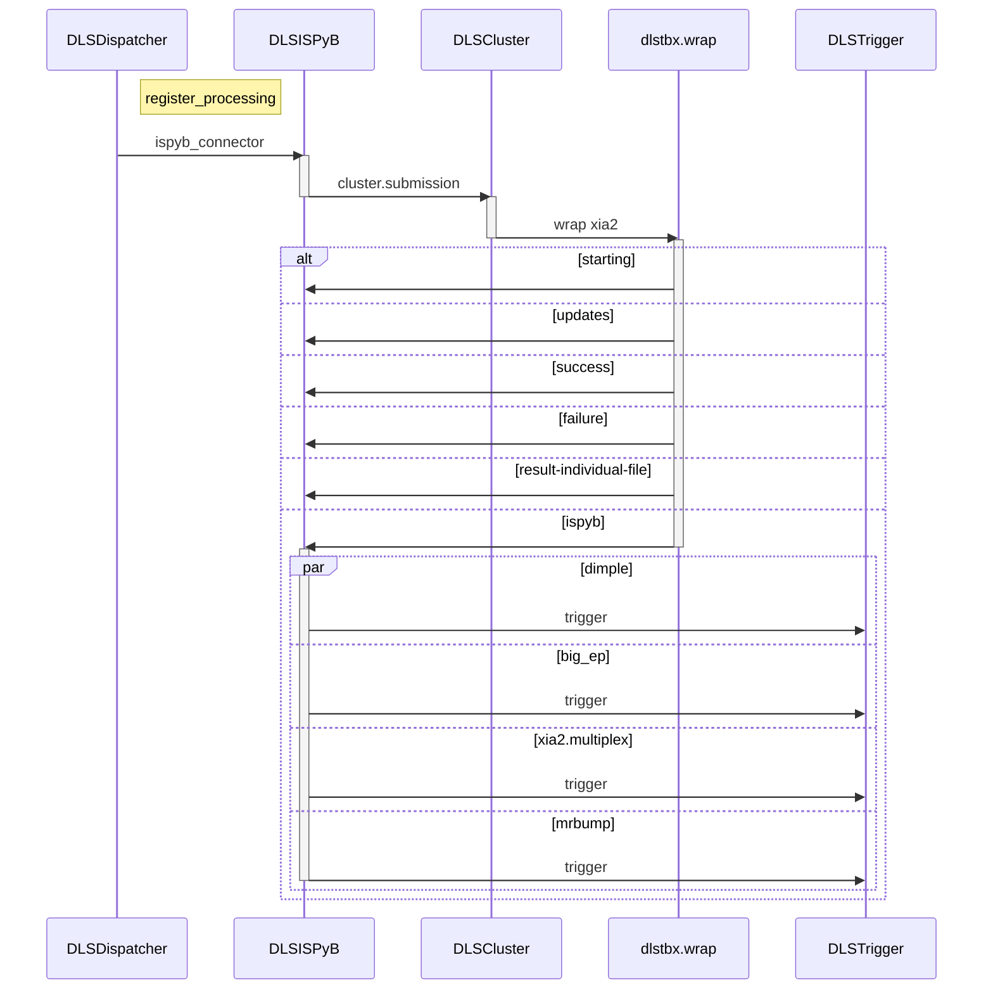

```mermaid
sequenceDiagram
    participant dispatcher as DLSDispatcher
    participant ispybsvc as DLSISPyB
    participant cluster as DLSCluster
    participant wrap as dlstbx.wrap
    participant trigger as DLSTrigger
    note right of dispatcher: register_processing
    dispatcher->>ispybsvc: ispyb_connector
    activate ispybsvc
    ispybsvc->>cluster: cluster.submission
    deactivate ispybsvc
    activate cluster
    cluster->>wrap: wrap xia2
    deactivate cluster
    activate wrap
    alt starting
        wrap->>ispybsvc: 
    else updates
        wrap->>ispybsvc: 
    else success
        wrap->>ispybsvc: 
    else failure
        wrap->>ispybsvc: 
    else result-individual-file
        wrap->>ispybsvc: 
    else ispyb
        wrap->>ispybsvc: 
        deactivate wrap
        activate ispybsvc
        par dimple
            ispybsvc->>trigger: trigger
        and big_ep
            ispybsvc->>trigger: trigger
        and xia2.multiplex
            ispybsvc->>trigger: trigger
        and mrbump
            ispybsvc->>trigger: trigger
            deactivate ispybsvc
        end
    end
```